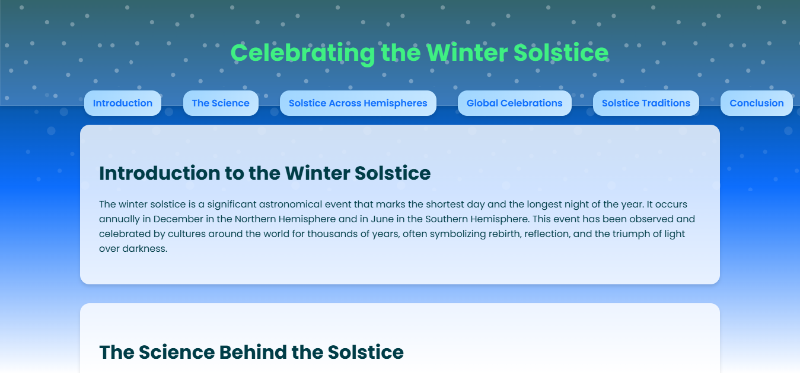

# Winter Solstice Celebrations Around the World

This HTML document provides an informative overview of the winter solstice, including:

* **Introduction:** Explains the significance of the winter solstice as the shortest day of the year.
* **Science:** Details the astronomical causes of the solstice, including Earth's tilt and the Sun's position.
* **Hemispheres:** Describes how the solstice is experienced differently in the Northern and Southern Hemispheres.
* **Celebrations:** Highlights specific examples of winter solstice celebrations from around the world, such as Newgrange in Ireland and Inti Raymi in Peru.
* **Traditions:** Outlines common traditions associated with the solstice, including bonfires, feasting, and gift-giving.
* **Conclusion:** Emphasizes the global significance and shared human experiences surrounding the winter solstice.

**Key Features:**

* **Clear Structure:** Uses HTML sections and headings to organize information effectively.
* **Navigation:** Includes a navigation menu for easy access to different sections.
* **Visual Appeal:** Employs basic styling with CSS to enhance readability and presentation.
* **Informative Content:** Provides a comprehensive and engaging overview of the winter solstice.

**To Use:**

1. **Save:** Save the code as an HTML file (e.g., `index.html`).
2. **Open in Browser:** Open the saved file in a web browser to view the webpage.

**Note:**

This is a basic HTML structure. You can further enhance it by:

* Adding more CSS styling for visual appeal.
* Including images and multimedia to enrich the content.
* Adding interactive elements like a map or a quiz.
* Implementing JavaScript for dynamic features.

